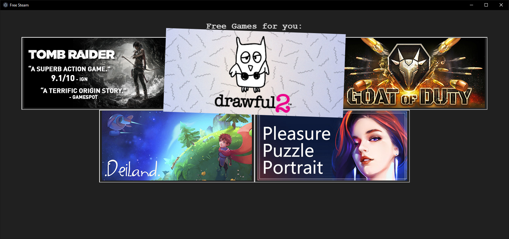

    <!-- # TODO: add Image -->
    <h1>~ Free-Steam ~</h1> 
    <strong> A little Desktop app to show games on Steam that are free for a limited time </strong>

---

[Preview](#Preview)   
[How to use](#how-to-use)  
[How to install](#how-to-install)

---

# Preview

# How to use

##### Disclaimer
Free-Steam just grabs games from Steam that are Free for a limited time but you will have it forever and they are quite rare so don't expect to get a free game every hour.

After your PC has booted just open the Program and look if something new is there for you then just minimize it DON'T CLOSE IT. if a new game gets free to keep you will get a Notification.

# How to install

> Just for Windows at the time
#### Please make sure to uninstall any old version of Free-Steam before installing a new one
Just grab the newest installer from the [Releases Page](https://github.com/7h3730B/Free-Steam/releases)
